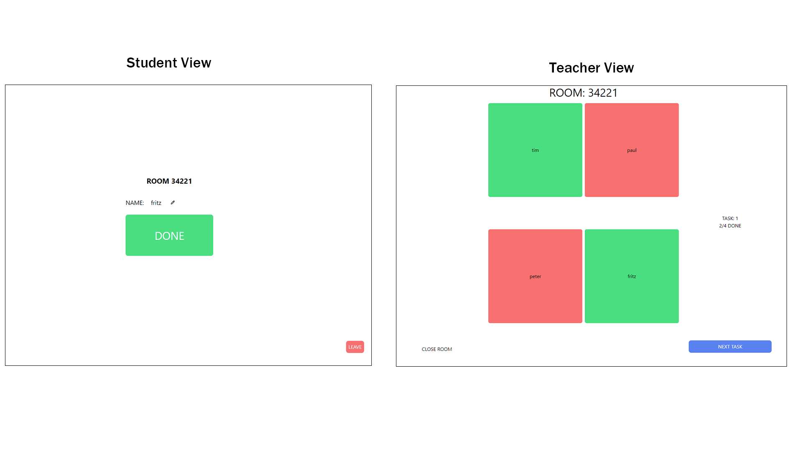

this webapp allows you to get easy feedback whether student who work with computers are done with a task in realtime.

##

## UI

### Tech used
- [React](https://github.com/facebook/react)
- [pusher](https://github.com/pusher/pusher-js)
- [tailwind](https://github.com/tailwindlabs/tailwindcss)
- [vite](https://github.com/vitejs/vite)
- Vercel for deployment